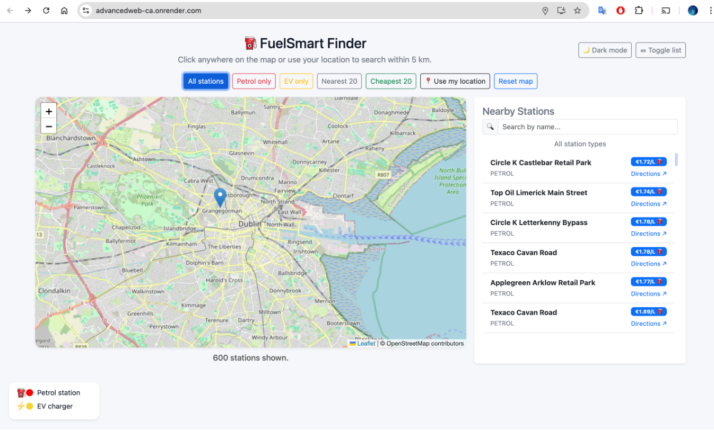

gtihub : https://github.com/jade724/AdvancedWeb-CA

# ⛽ FuelSmart Finder  
### Advanced Web Technologies — CA2 Submission  
**Student:** Precious Omotayo  
**Module:** Advanced Webmapping
**Assessment:** CA2 – Full-Stack Web Application  

FuelSmart Finder is a full-stack geospatial web application that enables users to locate and compare petrol stations and EV charging points across Ireland.  
The system integrates **Django**, **Leaflet.js**, **REST APIs**, **Docker**, **PostgreSQL/PostGIS**, and **Nginx** to deliver an interactive map-based fuel finder.

---

## 📌 1. Application Overview

FuelSmart Finder demonstrates the following:

- Backend development with **Django + Django REST Framework**  
- Geospatial logic using **bounding-box filtering**  
- Interactive frontend mapping using **Leaflet.js + Marker Clustering**  
- Consumption of external services (OpenChargeMap API)  
- Deployment inside a **Docker multi-container architecture**  
- Optional cloud deployment using **Render (Docker Web Service)**  

Users can:

- View 600 fuel stations across Ireland  
- Filter by **petrol**, **EV**, **cheapest 20**, **nearest 20**  
- Click anywhere on the map to search within 5 km  
- Retrieve POIs near EV chargers  

---

## 📸 2. Screenshots

### **Localhost Version**


### **Live Render Deployment**



### **Docker Desktop Environment**


### **Render Dashboard**


---

## 🧠 3. System Architecture Overview
         ┌───────────────────┐
         │ Leaflet Frontend  │
         │  (map.js + UI)    │
         └─────────┬─────────┘
                   │ fetch()
                   ▼
      ┌────────────────────────────┐
      │ Django REST API (JSON)     │
      │ /api/stations/...          │
      └─────────┬──────────────────┘
                │ Bounding-box filter
                ▼
      ┌────────────────────────────┐
      │ PostgreSQL + PostGIS       │
      │ Station coordinates stored │
      └────────────────────────────┘


---

## 🧰 4. Tech Stack

| Layer | Technology |
|-------|-----------|
| **Backend** | Django 5 + Django REST Framework |
| **Database** | PostgreSQL 16 + PostGIS extension |
| **Frontend** | Leaflet.js, MarkerCluster, Bootstrap 5 |
| **Deployment** | Docker + Docker Compose |
| **Reverse Proxy** | Nginx |
| **WSGI Server** | Gunicorn |
| **Cloud Hosting** | Render (Docker Web Service) |
| **Data format** | JSON / GeoJSON |

---

## 📦 5. Docker Architecture

Your system runs inside a **3-container stack**:

| Service | Purpose |
|---------|---------|
| **web** | Django + Gunicorn application |
| **db** | PostgreSQL + PostGIS |
| **nginx** | Reverse proxy + static file server |

Start the full stack:

```bash
docker compose up -d --build

Load the 600-station dataset:
docker compose exec web python manage.py loaddata stations_seed_fixed.json

## 🗺️ 6. Core Features
✔ 6.1 Interactive Map
•	Leaflet renders Ireland map
•	MarkerCluster groups petrol/EV markers
•	Popups show station name, type, and price
✔ 6.2 Filters and Tools
•	All stations
•	Petrol only
•	EV only
•	Cheapest 20
•	Nearest 20
•	Use my location
•	Reset map
✔ 6.3 POI Integration
Stations can return OpenChargeMap data for nearby EV charging points.

#🧩 7. Backend (Django)
7.1 Station Model
class Station(models.Model):
    name = models.CharField(max_length=255)
    station_type = models.CharField(max_length=10)
    fuel_price = models.DecimalField(max_digits=5, decimal_places=2, null=True)
    latitude = models.FloatField()
    longitude = models.FloatField()
    updated_at = models.DateTimeField(auto_now=True)

7.2 Bounding-Box Spatial Filtering (Not PostGIS)
Instead of using Polygon/PointField, the app uses:
stations = Station.objects.filter(
    latitude__gte=min_lat,
    latitude__lte=max_lat,
    longitude__gte=min_lng,
    longitude__lte=max_lng
)

7.3 Endpoints

Endpoint	Description
/api/stations/	All stations
/api/stations/petrol/	Petrol only
/api/stations/ev/	EV only
/api/stations/nearest/?lat=..&lng=..	Nearest 20
/api/stations/cheapest/	Cheapest 20
/api/poi/?lat=..&lng=..	External EV POIs

🎨 8. Frontend (Leaflet.js)
8.1 Marker Clustering
This is why markers group into bubbles:
const markers = L.markerClusterGroup();
markers.addLayer(marker);
map.addLayer(markers);

8.2 Custom Icons
Stored in:
/static/icons/petrol.svg
/static/icons/ev.svg

8.3 Sidebar Updates
The sidebar updates dynamically based on API results.

🌍 9. Deployment (Render)
Render uses the Dockerfile and deploys:
•	Gunicorn web service
•	Nginx reverse proxy
•	Database hosted via Render PostgreSQL
Your deployed site URL:
https://advancedweb-ca.onrender.com

## ⚙️ Setup Guide
```bash
# 1. Clone
git clone https://github.com/yourusername/fuelsmart.git
cd fuelsmart

# 2. Create and activate virtual env
python -m venv venv
source venv/bin/activate

# 3. Install dependencies
pip install -r requirements.txt

# 4. Migrate database
python manage.py migrate

# 5. Create admin user
python manage.py createsuperuser

# 6. Run server
python manage.py runserver
Then open:

